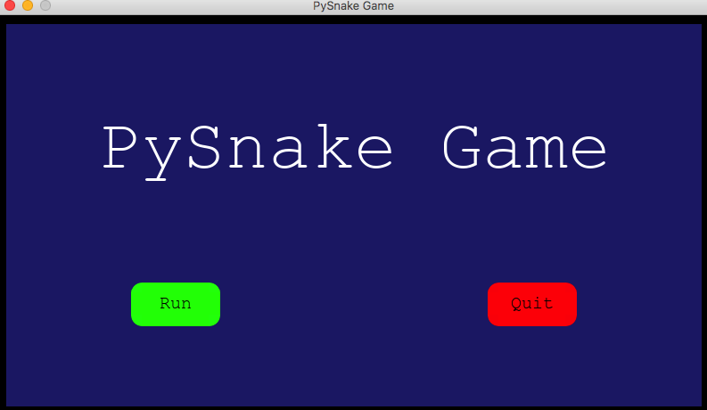
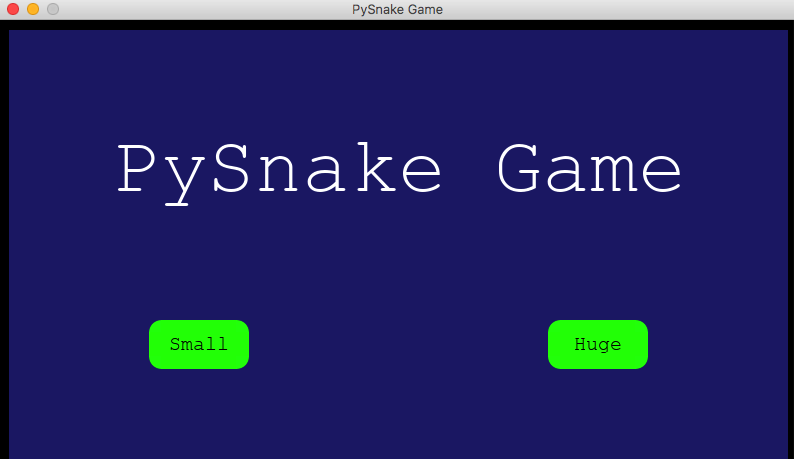
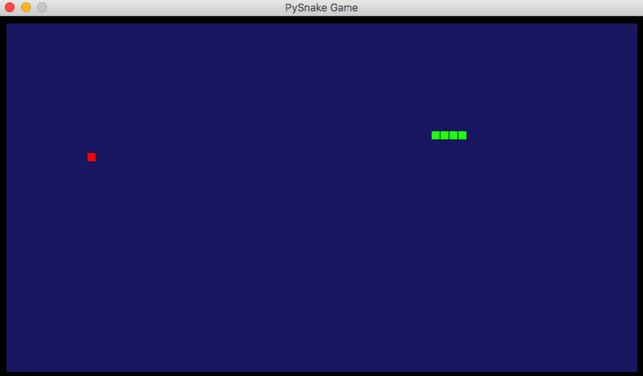
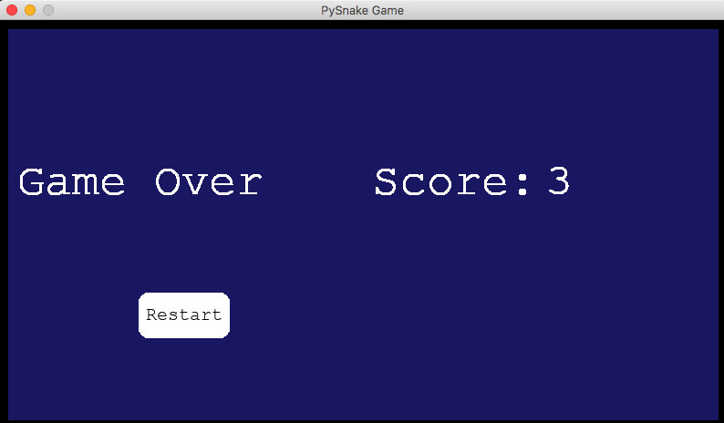

# Classic GUI snake game
A simple snake game written with python `pygame` package.

## Run a terminal snake game
Run script from the root directory of the project:
```bash
~ python snake_game.py
```

## Demo
- Start up menu


- Type of snake elements


- Game levels


- Game runner


- Game over


## Contributing

- clone the repository
- configure Git for the first time after cloning with your name and email
  ```bash
  git config --local user.name "Volodymyr Yahello"
  git config --local user.email "vyahello@gmail.com"
  ```
- `python3.6` is required to run the code